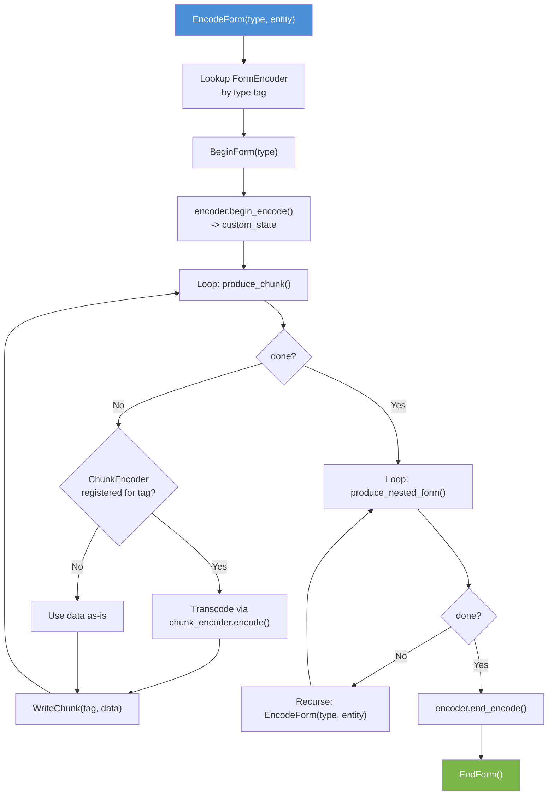

VulpesIFF Integration Guide
============================

### Using the VulpesIFF Reference Implementation

**Version**: 1.0
**Companion to**: [IFF-2025 Implementor's Guide](../IFF-2025/Docs/IFF-2025-implementors-guide.md)
**Language**: C23 (MinGW GCC 13.1)
**License**: MIT

---

## How to Read This Guide

This guide covers VulpesIFF-specific conventions, architecture, and API
patterns. For IFF-2025 format concepts (tag systems, container parsing, checksum
verification, segmentation), see the
[IFF-2025 Implementor's Guide](../IFF-2025/Docs/IFF-2025-implementors-guide.md).

---

# Part I: Architecture & Conventions

## Section 1 — Object Lifecycle Pattern

Every VulpesIFF type follows a four-phase lifecycle:

```
Allocate(type) -> pointer     // calloc, returns zeroed memory
Construct(pointer, args)      // Initialize fields, acquire resources
Deconstruct(pointer)          // Release owned resources, zero fields
Release(pointer)              // free the memory
```

Each phase returns `char`: `1` = success, `0` = failure.

`Construct` must be called exactly once after `Allocate`. `Deconstruct` must be
called exactly once before `Release`. These are not reference-counted --- the
caller is responsible for ensuring correct pairing.

## Section 2 --- Return Convention

All functions return `char`:
- `1` = success (the operation completed)
- `0` = failure (an error occurred, state may be partially modified)

There are no exceptions, no error codes, no errno. Callers check return values
at every call site.

## Section 3 --- Naming Conventions

**Public API**: `IFF_TypeName_FunctionName` (e.g., `IFF_Parser_Scan`)

**Private statics**: `PRIVATE_IFF_TypeName_FunctionName` or
`IFF_TypeName_PRIVATE_FunctionName`

**Parameters**: One per line, comma-leading continuation:

```c
char IFF_Parser_Factory_RegisterChunkDecoder(
    struct IFF_Parser_Factory *item
    , const struct IFF_Chunk_Key* chunk_key
    , struct IFF_ChunkDecoder *decoder
);
```

## Section 4 --- VulpesCore Dependencies

VulpesIFF uses the VulpesCore library for foundational types:

| VulpesCore Type         | Purpose in IFF                                   |
|-------------------------|--------------------------------------------------|
| `VPS_Data`              | Raw byte buffer (owns memory)                    |
| `VPS_DataReader`        | Sequential read cursor over VPS_Data             |
| `VPS_DataWriter`        | Sequential write cursor over VPS_Data            |
| `VPS_StreamReader`      | Buffered file input                              |
| `VPS_StreamWriter`      | Buffered file output                             |
| `VPS_List`              | Dynamic array (used for scope stacks, span lists)|
| `VPS_Dictionary`        | Hash map (used for decoder/algorithm registries) |
| `VPS_ScopedDictionary`  | Dictionary with push/pop scoping                 |
| `VPS_Set`               | Unique string set (used for algorithm ID sets)   |
| `VPS_Endian`            | Byte-order conversion helpers                    |
| `VPS_Decoder`           | Content decoder interface (future use)           |

## Section 5 --- Build Toolchain

- **Language**: C23 (`-std=gnu2x`)
- **Compiler**: MinGW GCC 13.1
- **Build system**: CMake + Ninja
- **Products**: Static libraries (`VulpesCore`, `VulpesIFF`)

---

# Part II: Implementation Type Reference

## Section 6 --- Read Stack Types

| Type                     | Layer    | Fields / Purpose                                       |
|--------------------------|----------|--------------------------------------------------------|
| `IFF_DataPump`           | Layer 1  | `stream_reader`, `data_buffer`, `data_reader` --- Buffered I/O |
| `IFF_DataTap`            | Layer 2  | `pump`, `registered_algorithms`, `active_spans` --- Checksum middleware |
| `IFF_Reader`             | Layer 3  | `tap`, `content_decoders` --- Primitive interpretation   |
| `IFF_Scope`              | Context  | `flags`, `boundary`, `container_variant/type`, decoder state --- Per-container read context |
| `IFF_ReaderFrame`        | Stack    | `reader`, `file_handle`, `iff85_locked` --- Saved reader state for inclusion |
| `IFF_Parser_Session`     | State    | `scope_stack`, `current_scope`, `session_state`, `iff85_locked`, `parsing_resumed`, `props`, `final_entity` |
| `IFF_Parser_State`       | Facade   | `session` --- Decoder-facing view (exposes `FindProp`)  |
| `IFF_Parser`             | Layer 4  | `session`, `reader`, decoder dictionaries, `reader_stack`, `segment_resolver`, `strict_references` |
| `IFF_Parser_Factory`     | Builder  | `form_decoders`, `chunk_decoders`, `directive_processors` --- Constructs configured parsers |

## Section 7 --- Write Stack Types

| Type                     | Layer    | Fields / Purpose                                       |
|--------------------------|----------|--------------------------------------------------------|
| `IFF_WritePump`          | Layer 1  | `stream_writer` --- Raw output                          |
| `IFF_WriteTap`           | Layer 2  | `pump`, `registered_algorithms`, `active_spans` --- Checksum middleware |
| `IFF_Writer`             | Layer 3  | `tap`, `content_encoders` --- Primitive serialization    |
| `IFF_WriteScope`         | Context  | `flags`, `container_variant/type`, `accumulator`, `accumulator_writer`, `bytes_written`, encoder state |
| `IFF_Generator`          | Layer 4  | `writer`, `scope_stack`, `file_handle`, `flags`, `blobbed_spans`, encoder dictionaries |
| `IFF_Generator_State`    | Facade   | `generator`, `flags` --- Encoder-facing view             |
| `IFF_Generator_Factory`  | Builder  | `form_encoders`, `chunk_encoders` --- Constructs configured generators |

---

# Part III: Writing Decoders

## Section 8 --- ChunkDecoder

### 8.1 The ChunkDecoder Vtable

A `ChunkDecoder` converts raw chunk bytes into a structured application object.
It has three callbacks:

```c
struct IFF_ChunkDecoder {
    // Called when the first part of the chunk is encountered
    char (*begin_decode)(
        struct IFF_Parser_State *state
        , void **custom_state
    );

    // Called for each data fragment (once without sharding, multiple with)
    char (*process_shard)(
        struct IFF_Parser_State *state
        , void *custom_state
        , const struct VPS_Data *chunk_data
    );

    // Called after the final shard; produces the decoded object
    char (*end_decode)(
        struct IFF_Parser_State *state
        , void *custom_state
        , struct IFF_ContextualData **out
    );
};
```

### 8.2 Registration

Chunk decoders are registered with the parser factory using a composite key
that pairs the container type with the chunk tag:

```
// Register a BMHD decoder for ILBM forms
IFF_Chunk_Key key = { .container_type = ILBM_tag, .chunk_tag = BMHD_tag };
IFF_Parser_Factory_RegisterChunkDecoder(factory, &key, bmhd_decoder);
```

### 8.3 Example: Decoding a Bitmap Header

```
// State for accumulating shard data
struct BMHD_State {
    VPS_Data* accumulated;
};

char bmhd_begin(IFF_Parser_State *state, void **custom_state):
    allocate BMHD_State -> s
    s.accumulated = NULL
    *custom_state = s
    return 1

char bmhd_process_shard(IFF_Parser_State *state, void *cs, const VPS_Data *data):
    BMHD_State *s = cs
    if s.accumulated == NULL:
        s.accumulated = clone(data)
    else:
        append data to s.accumulated
    return 1

char bmhd_end(IFF_Parser_State *state, void *cs, IFF_ContextualData **out):
    BMHD_State *s = cs
    // Parse the raw bytes into a structured bitmap header
    BitmapHeader *header = parse_bmhd_bytes(s.accumulated)

    // Optionally look up shared properties
    IFF_ContextualData *cmap = NULL
    IFF_Parser_State_FindProp(state, &CMAP_tag, &cmap)
    if cmap != NULL:
        apply_palette(header, cmap.data)

    // Wrap result in IFF_ContextualData
    IFF_ContextualData_Allocate(out)
    IFF_ContextualData_Construct(*out, current_flags, header_as_data)

    // Clean up
    release s.accumulated
    free s
    return 1
```

The decoded result is then routed by the parser:
- If inside a PROP scope: stored in the property dictionary
- If inside a FORM with a FormDecoder: passed to `process_chunk`
- Otherwise: released

---

## Section 9 --- FormDecoder

### 9.1 The FormDecoder Vtable

A `FormDecoder` assembles a high-level entity from the chunks and nested forms
within a FORM container. It has four callbacks:

```c
struct IFF_FormDecoder {
    // Called when entering the FORM
    char (*begin_decode)(
        struct IFF_Parser_State *state
        , void **custom_state
    );

    // Called for each decoded chunk within the FORM
    char (*process_chunk)(
        struct IFF_Parser_State *state
        , void *custom_state
        , struct IFF_Tag *chunk_tag
        , struct IFF_ContextualData *contextual_data
    );

    // Called for each decoded nested FORM
    char (*process_nested_form)(
        struct IFF_Parser_State *state
        , void *custom_state
        , struct IFF_Tag *form_type
        , void *final_entity
    );

    // Called when leaving the FORM; produces the final entity
    char (*end_decode)(
        struct IFF_Parser_State *state
        , void *custom_state
        , void **out_final_entity
    );
};
```

### 9.2 Registration

Form decoders are registered by form type tag:

```
IFF_Parser_Factory_RegisterFormDecoder(factory, &ILBM_tag, ilbm_decoder);
```

### 9.3 PROP Resolution from Within a Decoder

Both `process_chunk` and `end_decode` receive a `Parser_State` that exposes
`FindProp`. This allows decoders to pull shared properties:

```
char ilbm_end(IFF_Parser_State *state, void *cs, void **out_entity):
    ILBM_State *s = cs

    // Check if a CMAP was provided as a PROP
    if s.palette == NULL:
        IFF_ContextualData *prop_cmap = NULL
        IFF_Parser_State_FindProp(state, &CMAP_tag, &prop_cmap)
        if prop_cmap != NULL:
            s.palette = extract_palette(prop_cmap.data)

    // Assemble the final image entity
    *out_entity = build_image(s.header, s.palette, s.body)
    cleanup(s)
    return 1
```

### 9.4 Example: Decoding an ILBM Image

```
struct ILBM_State {
    BitmapHeader *header;
    Palette      *palette;
    PixelData    *body;
};

char ilbm_begin(state, custom_state):
    allocate ILBM_State -> s
    s.header = s.palette = s.body = NULL
    *custom_state = s
    return 1

char ilbm_process_chunk(state, cs, chunk_tag, contextual_data):
    ILBM_State *s = cs
    if chunk_tag matches BMHD:
        s.header = decode_header(contextual_data.data)
    else if chunk_tag matches CMAP:
        s.palette = decode_palette(contextual_data.data)
    else if chunk_tag matches BODY:
        s.body = decode_pixels(contextual_data.data, s.header)
    // Unknown chunks are silently ignored (forward compatibility)
    return 1

char ilbm_process_nested_form(state, cs, form_type, entity):
    // ILBM typically does not nest forms
    // But if it did, handle here
    return 1

char ilbm_end(state, cs, out_entity):
    ILBM_State *s = cs
    *out_entity = build_image(s.header, s.palette, s.body)
    free(s)
    return 1
```

---

# Part IV: Writing Encoders

## Section 10 --- ChunkEncoder

A `ChunkEncoder` has a single callback that serializes a structured object into
raw bytes:

```c
struct IFF_ChunkEncoder {
    char (*encode)(
        struct IFF_Generator_State *state
        , void *source_object
        , struct VPS_Data **out_data
    );
};
```

This is simpler than the decoder side because there is no sharding on encode ---
the encoder produces the complete chunk data in one call.

## Section 11 --- FormEncoder

### 11.1 The FormEncoder Vtable

A `FormEncoder` mirrors `FormDecoder` with four callbacks:

```c
struct IFF_FormEncoder {
    // Set up encoding state from the source entity
    char (*begin_encode)(
        struct IFF_Generator_State *state
        , void *source_entity
        , void **custom_state
    );

    // Produce chunks one at a time; set done=1 when finished
    char (*produce_chunk)(
        struct IFF_Generator_State *state
        , void *custom_state
        , struct IFF_Tag *out_tag
        , struct VPS_Data **out_data
        , char *out_done
    );

    // Produce nested FORMs one at a time; set done=1 when finished
    char (*produce_nested_form)(
        struct IFF_Generator_State *state
        , void *custom_state
        , struct IFF_Tag *out_form_type
        , void **out_nested_entity
        , char *out_done
    );

    // Clean up encoding state
    char (*end_encode)(
        struct IFF_Generator_State *state
        , void *custom_state
    );
};
```

### 11.2 Factory-Driven EncodeForm

The generator's `EncodeForm` function drives the encoding lifecycle:



### 11.3 Example: Encoding an ILBM Image

```
struct ILBM_EncState {
    Image *image;
    int    chunk_index;
    char   chunks_done;
};

char ilbm_begin_encode(state, entity, custom_state):
    allocate ILBM_EncState -> s
    s.image = (Image*)entity
    s.chunk_index = 0
    s.chunks_done = 0
    *custom_state = s
    return 1

char ilbm_produce_chunk(state, cs, out_tag, out_data, out_done):
    ILBM_EncState *s = cs
    switch s.chunk_index:
        case 0:
            *out_tag = BMHD_tag
            *out_data = encode_header(s.image.header)
            s.chunk_index++
        case 1:
            *out_tag = CMAP_tag
            *out_data = encode_palette(s.image.palette)
            s.chunk_index++
        case 2:
            *out_tag = BODY_tag
            *out_data = encode_pixels(s.image.body)
            s.chunks_done = 1
    *out_done = s.chunks_done
    return 1

char ilbm_produce_nested_form(state, cs, out_type, out_entity, out_done):
    *out_done = 1   // ILBM has no nested forms
    return 1

char ilbm_end_encode(state, cs):
    free(cs)
    return 1
```

Registration and invocation:

```
// Register
IFF_Generator_Factory_RegisterFormEncoder(factory, &ILBM_tag, ilbm_encoder);

// Use
IFF_Generator_WriteHeader(gen, &header);
IFF_Generator_EncodeForm(gen, &ILBM_tag, my_image);
IFF_Generator_Flush(gen);
```

---

# Part V: Parser Configuration

## Section 12 --- Strict References

By default, the parser silently consumes `' REF'` directives when no segment
resolver is registered, regardless of whether the reference is mandatory or
optional. This ensures forward compatibility with files containing references
that the host application does not support.

When `strict_references` is set to `1`, the parser will fail on mandatory
`' REF'` directives (those with `id_size > 0`) if no resolver is registered.
This enforces the spec's requirement that mandatory references must be
resolvable.

```c
// After creating the parser:
parser->strict_references = 1;
```

---

## License

This guide is part of the VulpesIFF project and is released under the
MIT License.
